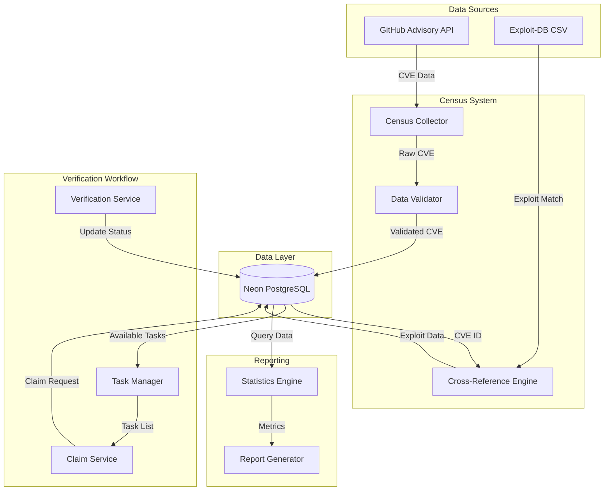

# Design Document: Web CVE Census System

## Overview

The Web CVE Census System is a research-oriented data collection and verification platform designed to systematically catalog web-related CVEs from 2015-2025. The system consists of three main components:

1. **Automated Census Collector**: Queries GitHub Advisory Database and Exploit-DB to build a comprehensive CVE dataset
2. **PostgreSQL Data Store**: Neon-hosted database providing structured storage and query capabilities
3. **Manual Verification Workflow**: Task management system enabling researchers to claim, verify, and document exploit feasibility

The system serves dual purposes: (1) generating academic research statistics on web vulnerability trends, and (2) creating ground truth datasets for AI-powered penetration testing tools.

## Architecture

### System Components



### Technology Stack

- **Database**: Neon PostgreSQL (cloud-hosted, serverless)
- **Language**: Python 3.10+
- **GitHub API**: PyGithub or requests library for GitHub Advisory Database
- **Data Processing**: pandas for CSV processing (Exploit-DB)
- **Database Driver**: psycopg2 or asyncpg for PostgreSQL connectivity
- **Validation**: pydantic for data validation
- **Testing**: pytest with hypothesis for property-based testing

### Deployment Environment

- **Client**: WSL (Ubuntu) + VSCode
- **Database**: Neon PostgreSQL (cloud, no local setup required)
- **Execution**: Docker containers for exploit verification
- **Concurrency**: Database-level locking for task claims

## Components and Interfaces

### 1. Census Collector

**Responsibility**: Query GitHub Advisory Database and collect ALL CVE data from web ecosystems

**Interface**:
```python
class CensusCollector:
    def collect_cves(
        self,
        start_year: int,
        end_year: int,
        ecosystems: List[str]
    ) -> List[CVEData]:
        """
        Collect ALL CVEs from GitHub Advisory Database for specified ecosystems
        
        Args:
            start_year: Starting year (2015-2025)
            end_year: Ending year (2015-2025)
            ecosystems: List of package ecosystems to include
            
        Returns:
            List of CVEData objects with is_priority_cwe labeled
        """
        pass
```

**GitHub Advisory API Integration**:
- Use GitHub GraphQL API for efficient querying
- **Filter at API level**: Apply ONLY year range (published_since=2015-01-01) and ecosystem filters in the API query
- **NO CWE filtering at API level**: Collect ALL CVEs from specified ecosystems to ensure 100% coverage
- **Batch size**: Limit each collection to ~100 CVEs per request to manage API quota and database load
- Extract: CVE ID, description, severity, CVSS scores, affected packages, CWE information
- **Post-processing**: Label CVEs with is_priority_cwe=TRUE if CWE matches priority categories (Injection, XSS, Authentication, Deserialization, SSRF, Path Traversal)
- Handle pagination for large result sets
- Implement rate limiting (5000 requests/hour for authenticated users)
- **Benefit**: Collecting all CVEs ensures no web vulnerabilities are missed, while labeling helps researchers prioritize

### 2. Data Validator

**Responsibility**: Validate CVE data before database insertion

**Interface**:
```python
class DataValidator:
    def validate_cve(self, cve_data: Dict[str, Any]) -> ValidationResult:
        """
        Validate CVE data against schema and business rules
        
        Validations:
            - CVE ID format: CVE-YYYY-NNNNN
            - CVSS scores: 0.0 - 10.0
            - Publication year: 2015 - 2025
            - Ecosystem: allowed list
            - CWE category: allowed list
            
        Returns:
            ValidationResult with success status and error messages
        """
        pass
```

**Validation Rules**:
- CVE ID: Regex pattern `^CVE-\d{4}-\d{4,}$`
- CVSS Base Score: Float range [0.0, 10.0]
- CVSS Exploitability Score: Float range [0.0, 10.0]
- Publication Year: Integer range [2015, 2025]
- Ecosystem: Enum {npm, maven, pip, composer, go, rubygems}
- CWE Category: Any valid CWE (no rejection, only labeling for priority CWEs)


### 3. Cross-Reference Engine

**Responsibility**: Match CVEs with Exploit-DB exploits

**Interface**:
```python
class CrossReferenceEngine:
    def __init__(self, exploitdb_csv_path: str):
        """Load Exploit-DB files_exploits.csv into memory"""
        pass
    
    def find_exploit(self, cve_id: str) -> Optional[ExploitData]:
        """
        Search for exploit matching CVE ID
        
        Args:
            cve_id: CVE identifier (e.g., CVE-2021-12345)
            
        Returns:
            ExploitData if found, None otherwise
        """
        pass
```

**Exploit-DB Integration**:
- Download `files_exploits.csv` from Exploit-DB repository
- Parse CSV columns: id, file, description, date, author, type, platform, port
- **Primary search**: Match CVE ID in description field
- **Fallback search**: If no CVE ID match, perform keyword search using affected package name and vulnerability type
- Cache results in memory for fast lookup
- Update CSV periodically (weekly recommended)

**Note**: Many Exploit-DB entries don't explicitly mention CVE IDs. The keyword fallback search helps identify relevant exploits by matching package names and vulnerability descriptions.

### 4. Database Schema

**Table**: `web_cve_census_master`

```sql
CREATE TABLE web_cve_census_master (
    -- Primary identification
    cve_id VARCHAR(20) PRIMARY KEY,
    
    -- CVE metadata
    description TEXT NOT NULL,
    severity VARCHAR(20),
    cvss_base_score DECIMAL(3,1),
    cvss_exploitability_score DECIMAL(3,1),
    affected_package VARCHAR(255),
    ecosystem VARCHAR(20) NOT NULL,
    publication_year INTEGER NOT NULL,
    cwe_category VARCHAR(50),
    
    -- CWE labeling (NEW)
    is_priority_cwe BOOLEAN DEFAULT FALSE,  -- TRUE if CWE matches priority categories
    
    -- Exploit-DB cross-reference
    exploit_available BOOLEAN DEFAULT FALSE,
    exploit_db_id VARCHAR(50),
    
    -- CVE exclusion mechanism (NEW)
    is_excluded BOOLEAN DEFAULT FALSE,      -- TRUE if researcher marked as non-web
    excluded_by VARCHAR(100),               -- Researcher who excluded (Minh/Hoàng)
    excluded_at TIMESTAMP,                  -- When CVE was excluded
    exclusion_reason TEXT,                  -- Why CVE was excluded
    
    -- Verification workflow
    build_status VARCHAR(20) DEFAULT 'NOT_ATTEMPTED',
    exploit_status VARCHAR(20) DEFAULT 'NONE',
    research_depth VARCHAR(20) DEFAULT 'LEVEL_0',
    assigned_to VARCHAR(100),
    assigned_at TIMESTAMP,
    claim_expires_at TIMESTAMP,
    exploit_notes TEXT,
    updated_at TIMESTAMP DEFAULT CURRENT_TIMESTAMP,
    
    -- Constraints
    CONSTRAINT chk_cvss_base CHECK (cvss_base_score BETWEEN 0.0 AND 10.0),
    CONSTRAINT chk_cvss_exploit CHECK (cvss_exploitability_score BETWEEN 0.0 AND 10.0),
    CONSTRAINT chk_year CHECK (publication_year BETWEEN 2015 AND 2025),
    CONSTRAINT chk_ecosystem CHECK (ecosystem IN ('npm', 'maven', 'pip', 'composer', 'go', 'rubygems')),
    CONSTRAINT chk_build_status CHECK (build_status IN ('NOT_ATTEMPTED', 'IN_PROGRESS', 'SUCCESS', 'FAILED')),
    CONSTRAINT chk_exploit_status CHECK (exploit_status IN ('NONE', 'POC_PUBLIC', 'EXPLOIT_DB', 'VERIFIED_SUCCESS', 'UNEXPLOITABLE')),
    CONSTRAINT chk_research_depth CHECK (research_depth IN ('LEVEL_0', 'LEVEL_1', 'LEVEL_2')),
    CONSTRAINT chk_exclusion_reason CHECK (is_excluded = FALSE OR exclusion_reason IS NOT NULL)
);

-- Indexes for common queries
CREATE INDEX idx_publication_year ON web_cve_census_master(publication_year);
CREATE INDEX idx_ecosystem ON web_cve_census_master(ecosystem);
CREATE INDEX idx_cwe_category ON web_cve_census_master(cwe_category);
CREATE INDEX idx_is_priority_cwe ON web_cve_census_master(is_priority_cwe);  -- NEW
CREATE INDEX idx_is_excluded ON web_cve_census_master(is_excluded);          -- NEW
CREATE INDEX idx_exploit_available ON web_cve_census_master(exploit_available);
CREATE INDEX idx_assigned_to ON web_cve_census_master(assigned_to);
CREATE INDEX idx_exploit_status ON web_cve_census_master(exploit_status);
```


### 5. Task Manager

**Responsibility**: Manage verification task lifecycle

**Interface**:
```python
class TaskManager:
    def get_available_tasks(
        self,
        filters: Optional[Dict[str, Any]] = None,
        limit: int = 5
    ) -> List[CVETask]:
        """
        Retrieve unclaimed or incomplete verification tasks
        
        Args:
            filters: Optional filters (ecosystem, year, exploit_available)
            limit: Maximum number of tasks to return
            
        Returns:
            List of available CVE tasks
        """
        pass
    
    def get_researcher_tasks(self, researcher_id: str) -> List[CVETask]:
        """Get all tasks assigned to a specific researcher"""
        pass
```

**Task Selection Logic**:
- Priority: CVEs with `exploit_available = TRUE`
- Order: Descending by publication year (2025 → 2015)
- **Batch allocation**: 10 tasks per researcher per year (configurable)
- **Team members**: System recognizes "Minh" and "Hoàng" as valid researcher IDs
- Filter: Exclude tasks with `exploit_status = 'CONFIRMED_SUCCESS'`
- Filter: Exclude expired claims (where `claim_expires_at < NOW()`)
- **Workflow**: Start with 2025, allocate 10 tasks to Minh, 10 to Hoàng, then move to 2024, etc.

### 6. Claim Service

**Responsibility**: Handle task claiming with concurrency control

**Interface**:
```python
class ClaimService:
    def claim_task(self, cve_id: str, researcher_id: str) -> ClaimResult:
        """
        Attempt to claim a CVE task for verification
        
        Uses database-level locking to prevent concurrent claims
        Sets claim expiration to 7 days from claim time
        
        Args:
            cve_id: CVE identifier to claim
            researcher_id: Researcher claiming the task (must be "Minh" or "Hoàng")
            
        Returns:
            ClaimResult with success status and message
        """
        pass
    
    def claim_batch(
        self,
        researcher_id: str,
        year: int,
        count: int = 10
    ) -> List[ClaimResult]:
        """
        Claim a batch of tasks from a specific year
        
        Args:
            researcher_id: Researcher claiming tasks ("Minh" or "Hoàng")
            year: Publication year to claim from (2015-2025)
            count: Number of tasks to claim (default: 10)
            
        Returns:
            List of ClaimResult for each claimed task
        """
        pass
    
    def release_task(self, cve_id: str, researcher_id: str) -> bool:
        """
        Release a claimed task back to the pool
        
        Args:
            cve_id: CVE identifier to release
            researcher_id: Researcher releasing the task
            
        Returns:
            True if released successfully
        """
        pass
```

**Concurrency Control**:
- Use PostgreSQL `SELECT ... FOR UPDATE` for atomic claims
- Transaction isolation level: READ COMMITTED
- **Claim validation**: Verify `assigned_to IS NULL` OR `claim_expires_at < NOW()` before claiming
- **Claim expiration**: Set `claim_expires_at` to 7 days from claim time (configurable)
- Set `assigned_to` and `assigned_at` atomically
- **Researcher validation**: Only accept researcher_id values "Minh" or "Hoàng"
- Rollback on conflict (another researcher claimed first or claim not yet expired)
- **Expired claims**: Automatically become available when `claim_expires_at` passes


### 7. Verification Service

**Responsibility**: Update verification status and results

**Interface**:
```python
class VerificationService:
    def update_build_status(
        self,
        cve_id: str,
        researcher_id: str,
        status: BuildStatus,
        notes: Optional[str] = None
    ) -> bool:
        """Update build status for a claimed CVE"""
        pass
    
    def update_exploit_status(
        self,
        cve_id: str,
        researcher_id: str,
        status: ExploitStatus,
        notes: str
    ) -> bool:
        """
        Update exploit verification status
        
        Note: CONFIRMED_SUCCESS requires non-empty notes
        """
        pass
    
    def update_research_depth(
        self,
        cve_id: str,
        researcher_id: str,
        depth: ResearchDepth
    ) -> bool:
        """Update research depth classification"""
        pass
```

**Business Rules**:
- Only assigned researcher can update their tasks
- `VERIFIED_SUCCESS` or `UNEXPLOITABLE` requires `exploit_notes` to be non-empty
- `updated_at` timestamp automatically updated on any change
- Validate enum values before database update
- Exploit status follows hierarchical order: NONE < POC_PUBLIC < EXPLOIT_DB < VERIFIED_SUCCESS/UNEXPLOITABLE

### 8. CVE Exclusion Service

**Responsibility**: Manage CVE exclusion and restoration for dataset curation

**Interface**:
```python
class ExclusionService:
    def exclude_cve(
        self,
        cve_id: str,
        researcher_id: str,
        reason: str
    ) -> bool:
        """
        Exclude a CVE from the active dataset
        
        Args:
            cve_id: CVE identifier
            researcher_id: Researcher performing exclusion (Minh/Hoàng)
            reason: Explanation for exclusion (e.g., "Desktop app, not web-related")
            
        Returns:
            True if exclusion successful
        """
        pass
    
    def restore_cve(
        self,
        cve_id: str,
        researcher_id: str
    ) -> bool:
        """
        Restore a previously excluded CVE
        
        Args:
            cve_id: CVE identifier
            researcher_id: Researcher performing restoration
            
        Returns:
            True if restoration successful
        """
        pass
    
    def list_excluded_cves(
        self,
        filters: Optional[Dict[str, Any]] = None
    ) -> List[CVEData]:
        """
        List all excluded CVEs with exclusion metadata
        
        Returns:
            List of excluded CVEs with exclusion_reason, excluded_by, excluded_at
        """
        pass
```

**Business Rules**:
- Exclusion reason must be non-empty
- Only researchers (Minh/Hoàng) can exclude/restore CVEs
- Exclusion metadata (excluded_by, excluded_at, exclusion_reason) is preserved
- Audit log tracks all exclusion/restoration operations
- Excluded CVEs are hidden from default queries but remain in database

### 9. Report Generator

**Responsibility**: Generate statistical reports and metrics with exclusion awareness

**Interface**:
```python
class ReportGenerator:
    def generate_census_report(
        self,
        filters: Optional[Dict[str, Any]] = None
    ) -> CensusReport:
        """
        Generate comprehensive census statistics
        
        Includes:
            - Total CVEs by year, ecosystem, CWE category
            - Exploit availability percentages
            - Verification completion rates
            - Build/exploit status distributions
        """
        pass
    
    def generate_researcher_report(self, researcher_id: str) -> ResearcherReport:
        """Generate per-researcher verification metrics"""
        pass
```

**Report Metrics**:
- Total CVEs collected
- CVEs by publication year (2015-2025)
- CVEs by ecosystem (npm, maven, pip, etc.)
- CVEs by CWE category
- Exploit availability rate (% with exploit_available = TRUE)
- Verification completion rate (% with exploit_status != 'NOT_VERIFIED')
- Build success rate (% with build_status = 'SUCCESS')
- Exploit success rate (% with exploit_status = 'VERIFIED_SUCCESS')
- Unexploitable rate (% with exploit_status = 'UNEXPLOITABLE')
- Per-researcher task counts and completion rates


## Data Models

### CVEData

```python
from dataclasses import dataclass
from typing import Optional
from datetime import datetime

@dataclass
class CVEData:
    cve_id: str
    description: str
    severity: str
    cvss_base_score: float
    cvss_exploitability_score: float
    affected_package: str
    ecosystem: str
    publication_year: int
    cwe_category: str
    exploit_available: bool = False
    exploit_db_id: Optional[str] = None
```

### ExploitData

```python
@dataclass
class ExploitData:
    exploit_db_id: str
    exploit_type: str
    publication_date: datetime
    description: str
```

### CVETask

```python
@dataclass
class CVETask:
    cve_id: str
    description: str
    ecosystem: str
    publication_year: int
    exploit_available: bool
    exploit_db_id: Optional[str]
    build_status: str
    exploit_status: str
    research_depth: str
    assigned_to: Optional[str]
    assigned_at: Optional[datetime]
    claim_expires_at: Optional[datetime]
    exploit_notes: Optional[str]
```

### Enumerations

```python
from enum import Enum

class BuildStatus(Enum):
    NOT_ATTEMPTED = "NOT_ATTEMPTED"
    IN_PROGRESS = "IN_PROGRESS"
    SUCCESS = "SUCCESS"
    FAILED = "FAILED"

class ExploitStatus(Enum):
    NONE = "NONE"  # No exploit found
    POC_PUBLIC = "POC_PUBLIC"  # Found on GitHub/Blog (unverified)
    EXPLOIT_DB = "EXPLOIT_DB"  # Found on Exploit-DB (higher reliability)
    VERIFIED_SUCCESS = "VERIFIED_SUCCESS"  # Team verified successful exploitation (ground truth)
    UNEXPLOITABLE = "UNEXPLOITABLE"  # Team attempted but failed (also ground truth)

class ResearchDepth(Enum):
    LEVEL_0 = "LEVEL_0"  # Metadata only, no code review
    LEVEL_1 = "LEVEL_1"  # Code review and initial assessment
    LEVEL_2 = "LEVEL_2"  # Complete analysis with Docker and exploitation

class Ecosystem(Enum):
    NPM = "npm"
    MAVEN = "maven"
    PIP = "pip"
    COMPOSER = "composer"
    GO = "go"
    RUBYGEMS = "rubygems"

class CWECategory(Enum):
    INJECTION = "Injection"
    XSS = "XSS"
    AUTHENTICATION = "Authentication"
    DESERIALIZATION = "Deserialization"
    SSRF = "SSRF"
    PATH_TRAVERSAL = "Path Traversal"
```


## Correctness Properties

*A property is a characteristic or behavior that should hold true across all valid executions of a system—essentially, a formal statement about what the system should do. Properties serve as the bridge between human-readable specifications and machine-verifiable correctness guarantees.*

### Property 1: Date Range Filtering

*For any* date range within 2015-2025, when the Census Collector queries GitHub Advisory, all returned CVEs should have publication dates within the specified range.

**Validates: Requirements 1.1**

### Property 2: CWE and Ecosystem Filtering

*For any* CVE dataset, when applying CWE filters (Injection, XSS, Authentication, Deserialization, SSRF, Path Traversal) and ecosystem filters (npm, maven, pip, composer, go, rubygems), all returned CVEs should match at least one CWE filter AND one ecosystem filter.

**Validates: Requirements 1.2, 1.3, 9.2**

### Property 3: Data Extraction Completeness

*For any* CVE collected from GitHub Advisory, all required fields (CVE ID, description, severity, CVSS scores, affected package, ecosystem, publication date) should be extracted and non-null.

**Validates: Requirements 1.4**

### Property 4: Database Round-Trip Consistency

*For any* valid CVE data, storing it to the database and then retrieving it should produce an equivalent CVE object with all fields preserved.

**Validates: Requirements 1.5, 2.5**

### Property 5: Exploit Cross-Reference Completeness

*For any* CVE processed by the system, an Exploit-DB lookup should be performed, and the result (found or not found) should be recorded in the database.

**Validates: Requirements 2.1, 2.3, 2.4, 9.3**

### Property 6: CVE ID Uniqueness

*For any* attempt to insert a CVE with a duplicate CVE_ID, the database should reject the insertion and preserve the existing record.

**Validates: Requirements 3.3**

### Property 7: Data Integrity on Update

*For any* CVE record, performing multiple updates should preserve all unchanged fields and correctly update only the specified fields without data corruption.

**Validates: Requirements 3.4**

### Property 8: Query Filtering Correctness

*For any* combination of filters (publication year, ecosystem, CWE category, build status, exploit status), the query results should contain only CVEs matching ALL specified filter criteria.

**Validates: Requirements 3.5, 5.3, 7.5**

### Property 9: Task Claim Mutual Exclusion

*For any* CVE task, when multiple researchers attempt to claim it concurrently, exactly one researcher should successfully claim it (if unclaimed or expired), and all others should receive a failure response.

**Validates: Requirements 4.2, 10.1**

### Property 9a: Claim Expiration

*For any* claimed CVE task, if the claim_expires_at timestamp has passed, the task should become available for other researchers to claim.

**Validates: Requirements 10.3**

### Property 10: Enum Validation

*For any* field with enumerated values (build_status, exploit_status, research_depth, ecosystem, cwe_category), the system should accept only valid enum values and reject invalid values. Additionally, researcher_id should only accept "Minh" or "Hoàng".

**Validates: Requirements 4.3, 4.4, 6.1, 8.4, 8.5**

### Property 11: Verification Notes Requirement

*For any* CVE being marked with exploit_status = 'VERIFIED_SUCCESS' or 'UNEXPLOITABLE', the update should be rejected if exploit_notes is empty or null.

**Validates: Requirements 5.2**

### Property 12: Timestamp Tracking

*For any* update to verification status or task assignment, the system should record or update the corresponding timestamp (updated_at or assigned_at).

**Validates: Requirements 5.5, 10.2**

### Property 13: CVE ID Format Validation

*For any* CVE ID, the system should accept only strings matching the pattern CVE-YYYY-NNNNN (where YYYY is 4 digits and NNNNN is 4+ digits) and reject malformed identifiers.

**Validates: Requirements 8.1**

### Property 14: CVSS Score Range Validation

*For any* CVSS score (base or exploitability), the system should accept only values in the range [0.0, 10.0] and reject values outside this range.

**Validates: Requirements 8.2**

### Property 15: Publication Year Range Validation

*For any* publication year, the system should accept only years in the range [2015, 2025] and reject years outside this range.

**Validates: Requirements 8.3**

### Property 16: Report Aggregation Accuracy

*For any* dataset, when generating reports with grouping by year/ecosystem/CWE, the sum of all group counts should equal the total number of CVEs in the dataset.

**Validates: Requirements 7.1, 7.4**

### Property 17: Percentage Calculation Accuracy

*For any* dataset, when calculating exploit availability percentage, the result should equal (count of exploit_available=TRUE / total count) * 100.

**Validates: Requirements 7.2**

### Property 18: Researcher Completion Rate Accuracy

*For any* researcher, the verification completion rate should equal (count of tasks with exploit_status != 'NOT_VERIFIED' / total assigned tasks) * 100.

**Validates: Requirements 7.3**

### Property 19: Census Error Resilience

*For any* error encountered during automated census (API failure, network timeout, invalid data), the system should log the error and continue processing remaining CVEs without terminating.

**Validates: Requirements 9.5**

### Property 20: Task Release and Reclaim

*For any* CVE task, if a researcher releases it (sets assigned_to to NULL), another researcher should be able to successfully claim it.

**Validates: Requirements 10.3**

### Property 21: Available Task Filtering

*For any* query for available tasks, the results should include only CVEs where (assigned_to is NULL OR claim_expires_at < NOW()) AND exploit_status is not 'VERIFIED_SUCCESS'.

**Validates: Requirements 10.4**

### Property 22: Researcher Task Query

*For any* researcher ID, querying their assigned tasks should return all and only CVEs where assigned_to equals that researcher ID.

**Validates: Requirements 10.5**

### Property 23: Batch Claim Allocation

*For any* batch claim request for a specific year, the system should allocate up to the requested number of unclaimed CVEs from that year, prioritizing those with exploit_available = TRUE.

**Validates: Requirements 10.1, 10.4**


## Error Handling

### API Errors

**GitHub Advisory API**:
- Rate limiting: Implement exponential backoff, respect `X-RateLimit-Remaining` header
- Network timeouts: Retry up to 3 times with increasing delays (5s, 10s, 20s)
- Authentication failures: Log error and terminate with clear message
- Invalid responses: Log malformed data, skip record, continue processing

**Exploit-DB CSV**:
- File not found: Log error and mark all CVEs as `exploit_available = FALSE`
- Parse errors: Skip malformed rows, log line numbers, continue processing
- Encoding issues: Try UTF-8, fallback to latin-1, log warnings

### Database Errors

**Connection failures**:
- Retry connection up to 3 times with 5-second delays
- If all retries fail, terminate with error message
- Log connection parameters (excluding credentials)

**Constraint violations**:
- Duplicate CVE_ID: Log warning, skip insertion, continue
- Invalid enum values: Log validation error, skip record
- NULL constraint violations: Log error with field name, skip record

**Transaction failures**:
- Deadlock detection: Retry transaction up to 3 times
- Lock timeout: Log error, return failure to user
- Rollback on any error within transaction

### Concurrency Errors

**Task claim conflicts**:
- Return `ClaimResult(success=False, message="Task already claimed")`
- Do not raise exception
- Log conflict for monitoring

**Simultaneous updates**:
- Use optimistic locking with `updated_at` timestamp
- Detect stale updates and reject with clear error message
- Prompt user to refresh and retry

### Validation Errors

**Data validation failures**:
- Collect all validation errors for a record
- Return detailed error messages listing all violations
- Do not partially insert invalid data
- Log validation failures for analysis

**Business rule violations**:
- VERIFIED_SUCCESS or UNEXPLOITABLE without notes: Return error, do not update
- Update by non-assigned researcher: Return authorization error
- Invalid state transitions: Log error, return current state

### Error Logging

**Log levels**:
- ERROR: System failures, data corruption, unrecoverable errors
- WARNING: Validation failures, skipped records, retries
- INFO: Successful operations, census progress, task claims
- DEBUG: Detailed execution flow, SQL queries, API responses

**Log format**:
```python
{
    "timestamp": "2025-01-15T10:30:45Z",
    "level": "ERROR",
    "component": "CensusCollector",
    "message": "GitHub API rate limit exceeded",
    "context": {
        "remaining": 0,
        "reset_at": "2025-01-15T11:00:00Z"
    }
}
```


## Testing Strategy

### Dual Testing Approach

The system requires both unit testing and property-based testing for comprehensive coverage:

- **Unit tests**: Verify specific examples, edge cases, and error conditions
- **Property tests**: Verify universal properties across all inputs

Both approaches are complementary and necessary. Unit tests catch concrete bugs in specific scenarios, while property tests verify general correctness across a wide range of inputs.

### Property-Based Testing

**Framework**: Hypothesis (Python)

**Configuration**:
- Minimum 100 iterations per property test
- Each test tagged with feature name and property number
- Tag format: `# Feature: web-cve-census-system, Property N: [property text]`

**Test Coverage**:
- Each correctness property (1-22) implemented as a separate property test
- Generate random inputs using Hypothesis strategies
- Verify properties hold across all generated inputs

**Example Property Test**:
```python
from hypothesis import given, strategies as st
import pytest

# Feature: web-cve-census-system, Property 13: CVE ID Format Validation
@given(cve_id=st.text())
@pytest.mark.property_test
def test_cve_id_format_validation(cve_id):
    """For any CVE ID, system should accept only valid format CVE-YYYY-NNNNN"""
    validator = DataValidator()
    result = validator.validate_cve_id(cve_id)
    
    # Valid format: CVE-YYYY-NNNNN
    is_valid_format = bool(re.match(r'^CVE-\d{4}-\d{4,}$', cve_id))
    
    assert result.is_valid == is_valid_format
```

**Strategies for Data Generation**:
- CVE IDs: Mix of valid and invalid formats
- CVSS scores: Floats including edge cases (0.0, 10.0, negative, > 10.0)
- Years: Integers including valid range and boundary violations
- Enums: Valid enum values plus random strings
- Timestamps: Past, present, future dates
- Concurrent operations: Simulate multiple threads/processes

### Unit Testing

**Framework**: pytest

**Test Categories**:

1. **Component Integration Tests**:
   - GitHub API integration (with mocked responses)
   - Exploit-DB CSV parsing
   - Database operations (with test database)
   - Task claiming workflow

2. **Edge Case Tests**:
   - Empty result sets
   - Maximum field lengths
   - Special characters in text fields
   - Boundary values (year 2015, 2025)

3. **Error Condition Tests**:
   - API failures and timeouts
   - Database connection failures
   - Constraint violations
   - Concurrent claim conflicts

4. **Business Logic Tests**:
   - CONFIRMED_SUCCESS requires notes
   - Only assigned researcher can update
   - Task release and reclaim flow
   - Report calculation accuracy

**Example Unit Test**:
```python
def test_verified_success_requires_notes():
    """Test that VERIFIED_SUCCESS status requires exploit notes"""
    service = VerificationService(db_connection)
    
    # Attempt to set VERIFIED_SUCCESS without notes
    result = service.update_exploit_status(
        cve_id="CVE-2021-12345",
        researcher_id="Minh",
        status=ExploitStatus.VERIFIED_SUCCESS,
        notes=""  # Empty notes
    )
    
    assert result is False
    
    # Verify status was not updated
    task = service.get_task("CVE-2021-12345")
    assert task.exploit_status != ExploitStatus.VERIFIED_SUCCESS
```

### Integration Testing

**Test Database**:
- Use Neon PostgreSQL test instance or local PostgreSQL
- Reset database state before each test
- Use transactions and rollback for test isolation

**End-to-End Scenarios**:
1. Complete census collection workflow
2. Task claim → build → verify → report workflow
3. Concurrent researcher operations
4. Report generation with various filters

### Test Data

**Fixtures**:
- Sample CVE data from GitHub Advisory (anonymized)
- Exploit-DB CSV subset for testing
- Mock API responses for offline testing
- Pre-populated database states for workflow tests

**Data Generators**:
- Factory functions for CVEData, ExploitData, CVETask
- Hypothesis strategies for property tests
- Faker library for realistic text data

### Continuous Testing

**Pre-commit hooks**:
- Run unit tests
- Run linting (flake8, mypy)
- Check code formatting (black)

**CI/CD Pipeline**:
- Run full test suite (unit + property tests)
- Generate coverage report (target: 80%+)
- Run integration tests against test database
- Performance benchmarks for census collection

### Performance Testing

**Benchmarks**:
- Census collection: Target 100 CVEs/minute
- Database queries: < 100ms for filtered queries
- Task claim: < 50ms for atomic operation
- Report generation: < 5s for full dataset

**Load Testing**:
- Simulate 10 concurrent researchers claiming tasks
- Test with 10,000+ CVE records
- Measure database connection pool efficiency
